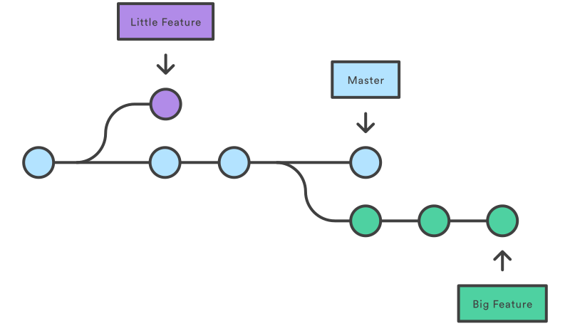

# How to use git and github

---
## Contents

 - Check your environment
 - Commit
 - Branch
   - Checkout
   - Merge
 - Push
 - hands-on

---
# Check your environment

 - What OS do you use ?
   - I expect you to use windows.
 - Is GitHub desktop installed ?
 - Do you have GitHub account ? 


---

# Commit

 - Git is a tool to manage change history by recording difference.
 - `commit` is a command to save diff and a unit of save.
 - It is important to `commit` frequently and give `commit` a name.


---

# Branch - concept

[Git Branch - Atlassian](https://www.atlassian.com/git/tutorials/using-branches)

> The diagram above(right) visualizes a repository with two isolated lines of development, one for a little feature, and one for a longer-running feature. By developing them in branches, it’s not only possible to work on both of them in parallel, but it also keeps the main master branch free from questionable code.



---

# Branch - usage

In situation
 - to debug
 - to develop new features

How to use
1. using `branch` command, make new branch by default branch 
2. change current branch to made branch in step 1
3. work and `commit`.
4. `merge` to default branch.

---

# Branch - commands

```shell
> git branch feature/random
> git checkout feature/random
```

this is same below

```shell
> git checkout -b feature/random
```

work something and commit them.

```
> git checkout main
```

`main` branch is default branch in this case.

```
> git merge feature/random
```

---
# Push

 - `commit` command save diffs on local.
 - You can save them to remote by `push` command.
 - Git can have multiple remote. Every remote should be named.
 - `push` command require remote name.

---

# Let's Get Started !!

## init
1. Open explorer
2. Create a folder named `random-generator` wherever you like.
3. Open Github Desktop and click `File` tab.
   1. Click `Add local Repository`

These proccesses is same as simple commands below

```
> cd random-generator
> git init
```

---

## Create file and Commit.
1. Open `random-generator` Folder by Editor(Visual Studio Code, Atom, Vim, Emacs). You can do that via clicking button in GitHub Desktop.
2. Create file named `random.c`
3. Copy and Paste this code.
4. Open GitHub Desktop and check your changes.
   1. `random.c` is marked green plus. It mean a new file.
   2. Green lines is added lines.

---

5. You may see `Create random.c` message at the bottom left. It is `commit message`. `commit message` should simply describe the commit. `git log` command show this part and you will know what the commit is by the `commit message`.
   1. `Description` is also `commit message` but they are displayed on the second and subsequent lines.
   2. Fill in these text box and Click `Commit to main`.

```
> git add random.c
> git commit -m "Create random.c"
```

---

## Push to remote(GitHub)
1. Click `Publish repository`
2. Check `Keep this code private` is checked.
3. Click `Publish repository` button.
4. Check https://github.com/USERNAME/random-generator

```
> git add origin github.com/USERNAME/random-generator
> git push origin main
```

---

## Problems

1. Number of iterations is hard coding. We want to specify the number of repetitions from keyboard input during program execution.
2. The signals of `start` and `end` does not have newline character. It looks not good.
---

## Create branch
Next, we will add process to enter a number. It is new feature, so we create new branch.
1. Open `Branch` tab at the top of window.
2. Click `New branch` and input `feature/input_repetition`
3. then, Click `Create branch`

```
> git branch feature/input_repetition
> git checkout feature/input_repetition
```
or 
```
> git checkout -b feature/input_repetition
```

---

## write something

1. Copy and paste this code and save.
2. Write `commit message`
3. Commit by clicking `Commit to feature/input_repetition`

---

## Question

If change branch to `main`, what will be happen ?

---

## Answer

the code in `random` function disappeared.

Why ?

---

## Create another branch
you can merge from `feature/input_repetition` into `main` but in this exrcise we start creating formatting feature.

Note: in practice, It's better to merge first, and then create branch.

1. Checkout to main branch.
2. Create `feature/format` branch and checkout to it.
3. Change code.
   1. `\n` is newline character.

---

## Merge
To integrate changes into `main` branch, we use `merge`

1. Open `Current branch` and checkout to `main`
   1. Note: You have to change current branch to destination branch.
   2. In this case, we integrate changes on `feature/input_repetetion` branch into `main` branch. So, the current branch have to `main` branch.
2. Reopen `Current branch` and `Choose a branch to merge into main`
3. Choose `feature/input_repetetion` and hogehoge
4. Check that codes is changed.
5. Repeat process above to merge `feature/format` branch's change into `main` branch.

---

## Merge (commands)

commands (I think you've already noticed, using Git via CLI is simple and easy way.)

```
> git checkout main
> git merge feature/input_repetition
> git merge feature/format
```

---
## Push again

Push a great code to remote.

```
> git push origin main
```

and check your page on github.com
